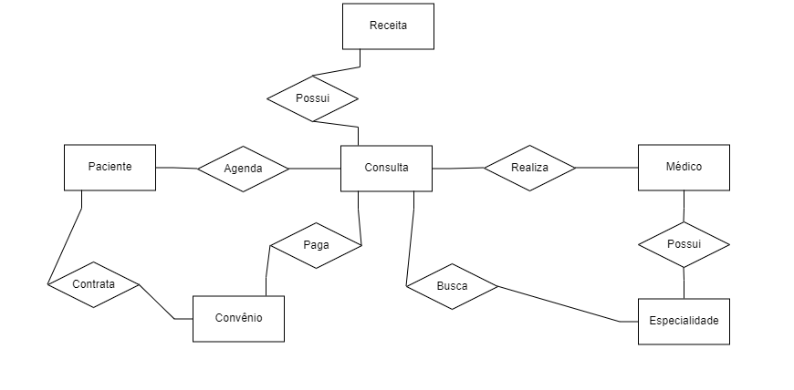

# Hospital Fundamental
Um pequeno hospital local busca desenvolver um novo sistema que atenda melhor às suas necessidades. Atualmente, parte da operação ainda se apoia em planilhas e arquivos antigos, mas espera-se que esses dados sejam transferidos para o novo sistema assim que ele estiver funcional. Neste momento, é necessário analisar com cuidado as necessidades desse cliente e sugerir uma estrutura de banco de dados adequada por meio de um Diagrama Entidade-Relacionamento.

## Estudo de caso

O hospital necessita de um sistema para sua área clínica que ajude a controlar consultas realizadas. Os médicos podem ser generalistas, especialistas ou residentes e têm seus dados pessoais cadastrados em planilhas digitais. Cada médico pode ter uma ou mais especialidades, que podem ser pediatria, clínica geral, gastroenterologia e dermatologia. Alguns registros antigos ainda estão em formulário de papel, mas será necessário incluir esses dados no novo sistema.

Os pacientes também precisam de cadastro, contendo dados pessoais (nome, data de nascimento, endereço, telefone e e-mail), documentos (CPF e RG) e convênio. Para cada convênio, são registrados nome, CNPJ e tempo de carência.

As consultas também têm sido registradas em planilhas, com data e hora de realização, médico responsável, paciente, valor da consulta ou nome do convênio, com o número da carteira. Também é necessário indicar na consulta qual a especialidade buscada pelo paciente.

Deseja-se ainda informatizar a receita do médico, de maneira que, no encerramento da consulta, ele possa registrar os medicamentos receitados, a quantidade e as instruções de uso. A partir disso, espera-se que o sistema imprima um relatório da receita ao paciente ou permita sua visualização via internet.

## Requisitos do Hospital

**RF001** O sistema deve permitir o cadastro dos profissionais do Hospital, contendo os dados pessoais como nome, CPF, data de nascimento, endereço, telefone e e-mail; seu cargo e suas especialidades.

**RF002** O atendente deve ser capaz de agendar uma consulta para o paciente com os dados: data e hora da realização, 
profissional responsável, paciente, valor da consulta ou convênio e especialidade buscada pelo paciente.

**RF003** O atendente deve ser capaz de cadastrar o paciente, com os dados pessoais como nome, data de nascimento, endereço, telefone, e-mail; documentos (CPF e RG) e os dados do convênio, como número da carteira.

**RF004** O sistema deve registrar o convênio de cada paciente com os dados: nome, número de carteira, CNPJ e tempo de carência.

**RF005** O paciente deve ser capaz de consultar os dados da sua consulta usando seu CPF, por meio do portal online da clínica.

**RF006** O médico deve ser capaz de encerrar a consulta registrando os medicamentos receitados, a quantidade e as instruções de uso.

**RF007** O sistema deve permitir a impressão de relatórios com os dados das consultas dos pacientes.

## Diagrama ER


# Os Segredos do Hospital
Após a primeira versão do projeto de banco de dados para o sistema hospitalar, notou-se a necessidade de expansão das funcionalidades, incluindo alguns requisitos essenciais a essa versão do software. As funcionalidades em questão são para o controle na internação de pacientes. Será necessário expandir o Modelo ER desenvolvido e montar o banco de dados, criando as tabelas para o início dos testes.

## Estudo de caso
Considere a seguinte descrição e o diagrama ER abaixo:

No hospital, as internações têm sido registradas por meio de formulários eletrônicos que gravam os dados em arquivos. 

Para cada internação, são anotadas a data de entrada, a data prevista de alta e a data efetiva de alta, além da descrição textual dos procedimentos a serem realizados. 

As internações precisam ser vinculadas a quartos, com a numeração e o tipo. 

Cada tipo de quarto tem sua descrição e o seu valor diário (a princípio, o hospital trabalha com apartamentos, quartos duplos e enfermaria).

Também é necessário controlar quais profissionais de enfermaria estarão responsáveis por acompanhar o paciente durante sua internação. Para cada enfermeiro(a), é necessário nome, CPF e registro no conselho de enfermagem (CRE).

A internação, obviamente, é vinculada a um paciente – que pode se internar mais de uma vez no hospital – e a um único médico responsável.

## Requisitos do Hospital

**RF001** O sistema deve permitir o cadastro dos profissionais do Hospital, contendo os dados pessoais como nome, CPF, data de nascimento, endereço, telefone e e-mail; seu cargo e suas especialidades.

**RF002** O atendente deve ser capaz de agendar uma consulta para o paciente com os dados: data e hora da realização, 
profissional responsável, paciente, valor da consulta ou convênio e especialidade buscada pelo paciente.

**RF003** O atendente deve ser capaz de cadastrar o paciente, com os dados pessoais como nome, data de nascimento, endereço, telefone, e-mail; documentos (CPF e RG) e os dados do convênio, como número da carteira.

**RF004** O sistema deve registrar o convênio de cada paciente com os dados: nome, número de carteira, CNPJ e tempo de carência.

**RF005** O paciente deve ser capaz de consultar os dados da sua consulta usando seu CPF, por meio do portal online da clínica.

**RF006** O médico deve ser capaz de encerrar a consulta registrando os medicamentos receitados, a quantidade e as instruções de uso.

**RF007** O sistema deve permitir a impressão de relatórios com os dados das consultas dos pacientes.

**RF008** O sistema deve permitir o registro das internações do paciente, com os dados: data de entrada no hospital, data prevista de alta, data da alta, descrição dos procedimentos, dados do quarto, enfermeiro, médico e paciente.

**RF009** O sistema deve permitir o cadastro dos quartos existentes no hospital, com a numeração, a descrição do quarto, valor diário e tipo do quarto.

**RF010** O sistema deve permitir o registro dos profissionais de enfermaria contendo os dados: nome, CPF e registro no conselho de enfermagem (CRE).

## Diagrama ER


## Código SQL

```sql
create database hospital;
use hospital;

create table medico (
	codigo_medico int primary key,
	nome_medico varchar(50) not null,
	cpf_medico varchar(15) unique not null,
	rg_medico varchar(9) unique not null,
	cargo_medico varchar(20) not null, 
	data_nasc_medico date not null
);

create table especialidade_medico(
	codigo_medico int not null,
    codigo_especialidade int not null
);

create table paciente (
	codigo_paciente int primary key,
	nome_paciente varchar(50) not null,
	cpf_paciente varchar(11) unique not null, 
	rg_paciente varchar(9) unique not null, 
	telefone_paciente varchar(11) not null,
	email_paciente varchar(50) unique not null,
	data_nasc_paciente date not null,
	numero_carteira_convenio int not null
);

create table convenio (
	numero_carteira int primary key, 
	nome_convenio varchar(50) not null,
	tempo_carencia varchar(10) not null,
	cnpj_convenio varchar(14) unique not null
);

create table consulta(
	codigo_consulta int primary key,
	data_consulta date not null,
	horario_consulta time not null,
	valor_consulta decimal(5,2) not null,
	forma_pagamento varchar(20) not null,
	codigo_paciente int not null,
	codigo_medico int not null, 
	codigo_especialidade int not null,
    numero_carteira_convenio int
);

create table especialidade(
	codigo_especialidade int primary key,
	descricao_especialidade varchar(50) not null
);

create table receita(
	codigo_receita int primary key,
    nome_medicamento varchar(100) not null,
    instrucoes_medicamento varchar(255) not null,
    qtd_medicamento int not null,
    codigo_consulta int not null
);

create table endereco(
	codigo_endereco int primary key,
    rua varchar(100) not null,
    bairro varchar(100) not null,
    cep varchar(9) not null,
    numero int not null,
    complemento varchar(100),
    codigo_paciente int not null
);

create table internacao(
	codigo_internacao int primary key,
    data_prevista_alta date not null,
    data_entrada date not null,
    data_alta date,
    codigo_medico int not null,
    numero_quarto int not null,
    codigo_paciente int not null,
    numero_carteira_convenio int
);

create table quarto(
	numero_quarto int primary key,
    codigo_tipo_quarto int not null
);

create table procedimento(
	codigo_procedimento int primary key,
    nome_procedimento varchar(50) not null,
    descricao_procedimento varchar(100) not null,
    codigo_internacao int not null
);

create table enfermeiro(
	codigo_enfermeiro int primary key,
    nome_enfermeito varchar(50) not null,
    rg_enfermeiro varchar(9) unique not null,
    cpf_enfermeiro varchar(15) unique not null,
	cre_enfermeiro varchar(20) unique not null,
    data_nasc_enfermeiro date not null
);

create table tipo_quarto(
	codigo_tipo_quarto int primary key,
    diaria_quarto decimal(5,2) not null,
    descricao_quarto varchar(200) not null
);

create table enfermeiro_internacao(
	codigo_enfermeiro int not null,
    codigo_internacao int not null
);

/*relacionando convenio e paciente*/
alter table paciente add foreign key fk_numero_carteira_convenio (numero_carteira_convenio) references convenio(numero_carteira);

/*relacionando consulta e especialidade*/
alter table consulta add foreign key fk_codigo_especialidade (codigo_especialidade) references especialidade(codigo_especialidade);

/*relacionando médico e consulta*/
alter table consulta add foreign key fk_codigo_medico (codigo_medico) references medico(codigo_medico);

/*relacionando paciente e consulta*/
alter table consulta add foreign key fk_codigo_paciente (codigo_paciente) references paciente(codigo_paciente);

/*relacionando consulta e receita*/
alter table receita add foreign key fk_codigo_consulta (codigo_consulta) references consulta(codigo_consulta);

/*relacionando consulta e convenio*/
alter table consulta add foreign key fk_numero_carteira_convenio (numero_carteira_convenio) references convenio(numero_carteira);

/*relacionando paciente e endereço*/
alter table endereco add foreign key fk_codigo_paciente (codigo_paciente) references paciente(codigo_paciente);

/*relacionando quarto e internação*/
alter table internacao add foreign key fk_numero_quarto (numero_quarto) references quarto(numero_quarto);

/*relacionando internação e procedimento*/
alter table procedimento add foreign key fk_codigo_internacao (codigo_internacao) references internacao(codigo_internacao);

/*relacionando internação e médico*/	
alter table internacao add foreign key fk_codigo_medico (codigo_medico) references medico(codigo_medico);

/*relacionando enfermeiro e internação*/
alter table enfermeiro_internacao add foreign key fk_codigo_enfermeiro (codigo_enfermeiro) references enfermeiro(codigo_enfermeiro);
alter table enfermeiro_internacao add foreign key fk_codigo_internacao (codigo_internacao) references internacao(codigo_internacao);

/*relacionando quarto e tipo*/
alter table quarto add foreign key fk_tipo_quarto (codigo_tipo_quarto) references tipo_quarto(codigo_tipo_quarto);

/*relacionando especialidade e médico*/
alter table especialidade_medico add foreign key fk_codigo_medico (codigo_medico) references medico(codigo_medico);
alter table especialidade_medico add foreign key fk_codigo_especialidade (codigo_especialidade) references especialidade(codigo_especialidade);

/*relacionando internação e paciente*/
alter table internacao add foreign key fk_codigo_paciente (codigo_paciente) references paciente(codigo_paciente);

/*relacionando internação e convênio*/
alter table internacao add foreign key fk_numero_carteira_convenio (numero_carteira_convenio) references convenio(numero_carteira);
```

# O Prisioneiro dos Dados
Com o banco de dados para o sistema hospitalar completamente montado, é necessário incluir dados para realizar os devidos testes e validar sua viabilidade quanto ao sistema. Nesta etapa, também é importante realizar a separação de alguns scripts iniciais para o banco, com os dados que serão necessários a um povoamento inicial do sistema.

- Inclua ao menos dez médicos de diferentes especialidades. Ao menos sete especialidades (considere a afirmação de que “entre as especialidades há pediatria, clínica geral, gastrenterologia e dermatologia”).

```sql
insert into especialidade (codigo_especialidade, descricao_especialidade) values
(1, 'Cardiologia'),
(2, 'Pediatria'),
(3, 'Clínica geral'),
(4, 'Ortopedia'),
(5, 'Dermatologia'),
(6, 'Psiquiatria'),
(7, 'Ginecologia'),
(8, 'Oftalmologia'),
(9, 'Gastroenterologia'),
(10, 'Oncologia');

insert medico (codigo_medico, nome_medico, cpf_medico, rg_medico, cargo_medico, data_nasc_medico, codigo_especialidade) values
(1, 'Dr. João Silva', '123.456.789-00', 'MG1234567', 'Cardiologista', '1975-04-15', 1),
(2, 'Dra. Maria Souza', '234.567.890-11', 'SP2345678', 'Pediatra', '1980-06-20', 2),
(3, 'Dr. Carlos Pereira', '345.678.901-22', 'RJ3456789', 'Neurologista', '1978-09-10', 3),
(4, 'Dra. Ana Lima', '456.789.012-33', 'PR4567890', 'Ortopedista', '1985-11-25', 4),
(5, 'Dr. Paulo Gomes', '567.890.123-44', 'RS5678901', 'Dermatologista', '1970-12-30', 5),
(6, 'Dra. Fernanda Alves', '678.901.234-55', 'SC6789012', 'Psiquiatra', '1982-03-18', 6),
(7, 'Dr. Luiz Martins', '789.012.345-66', 'BA7890123', 'Ginecologista', '1973-07-22', 7),
(8, 'Dra. Helena Castro', '890.123.456-77', 'DF8901234', 'Oftalmologista', '1988-05-14', 8),
(9, 'Dr. Ricardo Santos', '901.234.567-88', 'CE9012345', 'Gastroenterologista', '1976-10-05', 9),
(10, 'Dra. Carolina Fernandes', '012.345.678-99', 'GO0123456', 'Oncologista', '1981-08-19', 10);
```

- Inclua ao menos 15 pacientes.
```sql
insert into convenio (numero_carteira, nome_convenio, tempo_carencia, cnpj_convenio) values
(1, 'Unimed', '30 dias', '11122233000101'),
(2, 'Amil', '60 dias', '22233344000202'),
(3, 'Bradesco Saúde', '45 dias', '33344455000303'),
(4, 'SulAmérica', '30 dias', '44455566000404'),
(5, 'Golden Cross', '60 dias', '55566677000505');

insert into paciente (codigo_paciente, nome_paciente, cpf_paciente, rg_paciente, telefone_paciente, email_paciente, data_nasc_paciente, numero_carteira_convenio) values
(1, 'Alice Souza', '12345678901', 'MG1234567', '31987654321', 'alice@example.com', '1990-01-01', 1),
(2, 'Bruno Lima', '23456789012', 'SP2345678', '11987654322', 'bruno@example.com', '1985-02-02', 2),
(3, 'Carlos Pereira', '34567890123', 'RJ3456789', '21987654323', 'carlos@example.com', '1995-03-03', 3),
(4, 'Daniela Santos', '45678901234', 'PR4567890', '41987654324', 'daniela@example.com', '1980-04-04', 4),
(5, 'Eduardo Silva', '56789012345', 'RS5678901', '51987654325', 'eduardo@example.com', '1975-05-05', 5),
(6, 'Fernanda Oliveira', '67890123456', 'SC6789012', '61987654326', 'fernanda@example.com', '1988-06-06', 1),
(7, 'Gabriel Costa', '78901234567', 'BA7890123', '71987654327', 'gabriel@example.com', '1979-07-07', 2),
(8, 'Helena Martins', '89012345678', 'DF8901234', '81987654328', 'helena@example.com', '1992-08-08', 3),
(9, 'Igor Almeida', '90123456789', 'CE9012345', '91987654329', 'igor@example.com', '1983-09-09', 4),
(10, 'Julia Fernandes', '01234567890', 'GO0123456', '61987654330', 'julia@example.com', '1991-10-10', 5),
(11, 'Lucas Rocha', '12345098765', 'MA1234509', '71987654331', 'lucas@example.com', '1987-11-11', 1),
(12, 'Mariana Ribeiro', '23456109876', 'PA2345610', '81987654332', 'mariana@example.com', '1982-12-12', 2),
(13, 'Nicolas Lima', '34567210987', 'PE3456721', '91987654333', 'nicolas@example.com', '1993-01-13', 3),
(14, 'Olivia Silva', '45678321098', 'PI4567832', '61987654334', 'olivia@example.com', '1994-02-14', 4),
(15, 'Pedro Nunes', '56789432109', 'RJ5678943', '31987654335', 'pedro@example.com', '1990-03-15', 5);

insert into endereco (codigo_endereco, rua, bairro, cep, numero, complemento, codigo_paciente) values
(1, 'Rua A', 'Bairro A', '30123456', 101, 'Apto 1', 1),
(2, 'Rua B', 'Bairro B', '40123456', 102, 'Apto 2', 2),
(3, 'Rua C', 'Bairro C', '50123456', 103, 'Apto 3', 3),
(4, 'Rua D', 'Bairro D', '60123456', 104, 'Apto 4', 4),
(5, 'Rua E', 'Bairro E', '70123456', 105, 'Apto 5', 5),
(6, 'Rua F', 'Bairro F', '80123456', 106, 'Apto 6', 6),
(7, 'Rua G', 'Bairro G', '90123456', 107, 'Apto 7', 7),
(8, 'Rua H', 'Bairro H', '01123456', 108, 'Apto 8', 8),
(9, 'Rua I', 'Bairro I', '11123456', 109, 'Apto 9', 9),
(10, 'Rua J', 'Bairro J', '12123456', 110, 'Apto 10', 10),
(11, 'Rua K', 'Bairro K', '13123456', 111, 'Apto 11', 11),
(12, 'Rua L', 'Bairro L', '14123456', 112, 'Apto 12', 12),
(13, 'Rua M', 'Bairro M', '15123456', 113, 'Apto 13', 13),
(14, 'Rua N', 'Bairro N', '16123456', 114, 'Apto 14', 14),
(15, 'Rua O', 'Bairro O', '17123456', 115, 'Apto 15', 15);
```
- Registre 20 consultas de diferentes pacientes e diferentes médicos (alguns pacientes realizam mais que uma consulta). As consultas devem ter ocorrido entre 01/01/2015 e 01/01/2022. Ao menos dez consultas devem ter receituário com dois ou mais medicamentos.

```sql
insert into consulta (codigo_consulta, data_consulta, horario_consulta, valor_consulta, forma_pagamento, codigo_paciente, codigo_medico, codigo_especialidade, numero_carteira_convenio) values
(1, '2015-01-15', '09:00:00', 150.00, 'Cartão', 1, 1, 1, 1),
(2, '2015-02-20', '10:30:00', 200.00, 'Dinheiro', 2, 2, 2, 2),
(3, '2016-03-25', '11:00:00', 175.00, 'Cartão', 3, 3, 3, 3),
(4, '2016-04-10', '08:45:00', 180.00, 'Cartão', 4, 4, 4, 4),
(5, '2017-05-05', '14:00:00', 160.00, 'Cartão', 5, 5, 5, 5),
(6, '2017-06-15', '15:30:00', 190.00, 'Cartão', 6, 6, 6, 1),
(7, '2018-07-20', '09:15:00', 170.00, 'Dinheiro', 7, 7, 7, 2),
(8, '2018-08-25', '10:00:00', 165.00, 'Cartão', 8, 8, 8, 3),
(9, '2019-09-30', '11:30:00', 185.00, 'Cartão', 9, 9, 9, 4),
(10, '2019-10-15', '13:00:00', 175.00, 'Dinheiro', 10, 10, 10, 5),
(11, '2020-01-10', '14:15:00', 200.00, 'Cartão', 11, 1, 1, 1),
(12, '2020-02-15', '15:45:00', 150.00, 'Dinheiro', 12, 2, 2, 2),
(13, '2020-03-20', '16:00:00', 170.00, 'Cartão', 13, 3, 3, 3),
(14, '2020-04-25', '17:30:00', 180.00, 'Cartão', 14, 4, 4, 4),
(15, '2021-05-30', '08:30:00', 160.00, 'Cartão', 15, 5, 5, 5),
(16, '2021-06-05', '09:45:00', 190.00, 'Cartão', 1, 6, 6, 1),
(17, '2021-07-10', '10:00:00', 165.00, 'Dinheiro', 2, 7, 7, 2),
(18, '2021-08-15', '11:15:00', 175.00, 'Cartão', 3, 8, 8, 3),
(19, '2021-09-20', '12:00:00', 185.00, 'Cartão', 4, 9, 9, 4),
(20, '2022-01-01', '13:45:00', 150.00, 'Dinheiro', 5, 10, 10, 5);

insert into receita (codigo_receita, nome_medicamento, qtd_medicamento, instrucoes_medicamento, codigo_consulta) values
(1, 'Paracetamol', 1, 'Tomar 1 comprimido a cada 8 horas', 1),
(2, 'Ibuprofeno', 2, 'Tomar 1 comprimido a cada 6 horas', 2),
(3, 'Amoxicilina', 4, 'Tomar 1 cápsula a cada 12 horas por 7 dias', 3),
(4, 'Losartana', 3, 'Tomar 1 comprimido ao dia', 4),
(5, 'Omeprazol', 1, 'Tomar 1 cápsula ao dia', 5),
(6, 'Metformina', 2, 'Tomar 1 comprimido 2 vezes ao dia', 6),
(7, 'Lorazepam', 1, 'Tomar 1 comprimido ao dormir', 7),
(8, 'Diclofenaco', 5, 'Tomar 1 comprimido a cada 8 horas', 8),
(9, 'Cetoconazol', 6, 'Aplicar o creme na área afetada 2 vezes ao dia', 9),
(10, 'Azitromicina', 2, 'Tomar 1 comprimido ao dia por 3 dias', 10),
(11, 'Atenolol', 2, 'Tomar 1 comprimido ao dia', 11),
(12, 'Prednisona', 1, 'Tomar 1 comprimido ao dia', 12),
(13, 'Aspirina', 8, 'Tomar 1 comprimido a cada 12 horas', 13),
(14, 'Clonazepam', 4, 'Tomar 1 comprimido ao dormir', 14),
(15, 'Sinvastatina', 4, 'Tomar 1 comprimido ao dia', 15),
(16, 'Nimesulida', 3, 'Tomar 1 comprimido a cada 8 horas', 16),
(17, 'Levotiroxina', 6, 'Tomar 1 comprimido ao dia', 17),
(18, 'Alprazolam', 3, 'Tomar 1 comprimido ao dormir', 18),
(19, 'Pantoprazol', 1, 'Tomar 1 comprimido ao dia', 19),
(20, 'Fluconazol', 1, 'Tomar 1 comprimido ao dia por 7 dias', 20);

insert into receita (codigo_receita, nome_medicamento, qtd_medicamento, instrucoes_medicamento, codigo_consulta) values
(21, 'Paracetamol', 1, 'Tomar 1 comprimido a cada 8 horas', 1),
(22, 'Ibuprofeno', 1, 'Tomar 1 comprimido a cada 6 horas', 2),
(23, 'Amoxicilina', 2, 'Tomar 1 cápsula a cada 12 horas por 7 dias', 3),
(24, 'Losartana', 4, 'Tomar 1 comprimido ao dia', 4),
(25, 'Omeprazol', 4, 'Tomar 1 cápsula ao dia', 5),
(26, 'Metformina', 3, 'Tomar 1 comprimido 2 vezes ao dia', 6),
(27, 'Lorazepam', 2, 'Tomar 1 comprimido ao dormir', 7),
(28, 'Diclofenaco', 9, 'Tomar 1 comprimido a cada 8 horas', 8),
(29, 'Cetoconazol', 8, 'Aplicar o creme na área afetada 2 vezes ao dia', 9),
(30, 'Azitromicina', 6, 'Tomar 1 comprimido ao dia por 3 dias', 10),
(31, 'Atenolol', 1, 'Tomar 1 comprimido ao dia', 11),
(32, 'Prednisona', 2, 'Tomar 1 comprimido ao dia', 12),
(33, 'Aspirina', 5, 'Tomar 1 comprimido a cada 12 horas', 13),
(34, 'Clonazepam', 5, 'Tomar 1 comprimido ao dormir', 14),
(35, 'Sinvastatina', 2, 'Tomar 1 comprimido ao dia', 15),
(36, 'Nimesulida', 2, 'Tomar 1 comprimido a cada 8 horas', 16),
(37, 'Levotiroxina', 1, 'Tomar 1 comprimido ao dia', 17),
(38, 'Alprazolam', 7, 'Tomar 1 comprimido ao dormir', 18),
(39, 'Pantoprazol', 7, 'Tomar 1 comprimido ao dia', 19),
(40, 'Fluconazol', 1,  'Tomar 1 comprimido ao dia por 7 dias', 20);
```
- Associe ao menos cinco pacientes a cinco consultas
```sql
insert into consulta (codigo_consulta, data_consulta, horario_consulta, valor_consulta, forma_pagamento, codigo_paciente, codigo_medico, codigo_especialidade, codigo_convenio) values
(1, '2020-01-15', '10:00:00', 200.00, 'Cartão de Crédito', 1, 1, 1, 1),
(2, '2019-03-20', '14:00:00', 150.00, 'Dinheiro', 2, 2, 2, 2),
(3, '2021-07-10', '09:30:00', 180.00, 'Cartão de Débito', 3, 3, 3, 3),
(4, '2018-05-25', '11:00:00', 220.00, 'Cheque', 4, 4, 4, 4),
(5, '2017-11-30', '16:00:00', 170.00, 'Dinheiro', 5, 5, 5, 5);
```
- Registre ao menos sete internações. Pelo menos dois pacientes devem ter se internado mais de uma vez. Ao menos três quartos devem ser cadastrados. As internações devem ter ocorrido entre 01/01/2015 e 01/01/2022.
```sql
insert into quarto (numero_quarto, codigo_tipo_quarto) values
(101, 1),
(102, 2),
(103, 3),
(104, 1),
(105, 2);

insert into tipo_quarto (codigo_tipo_quarto, diaria_quarto, descricao_quarto) values
(1, 150.00, 'Apartamento'),
(2, 250.00, 'Enfermaria'),
(3, 350.00, 'Quarto duplo');

insert into enfermeiro (codigo_enfermeiro, nome_enfermeito, rg_enfermeiro, cpf_enfermeiro, cre_enfermeiro, data_nasc_enfermeiro) values
(1, 'Enf. Joana Martins', 'SP9876543', '123.456.789-01', 'CRE123456', '1985-03-10'),
(2, 'Enf. Carlos Eduardo', 'RJ8765432', '234.567.890-12', 'CRE234567', '1980-07-22'),
(3, 'Enf. Ana Paula Silva', 'MG7654321', '345.678.901-23', 'CRE345678', '1990-02-15'),
(4, 'Enf. Maria Clara Oliveira', 'BA6543210', '456.789.012-34', 'CRE456789', '1987-05-05'),
(5, 'Enf. José Antônio Sousa', 'RS5432109', '567.890.123-45', 'CRE567890', '1983-09-25'),
(6, 'Enf. Paula Mendes', 'SC4321098', '678.901.234-56', 'CRE678901', '1981-11-30'),
(7, 'Enf. Thiago Ribeiro', 'PR3210987', '789.012.345-67', 'CRE789012', '1984-04-14'),
(8, 'Enf. Laura Carvalho', 'PE2109876', '890.123.456-78', 'CRE890123', '1989-01-25'),
(9, 'Enf. Marcos Silva', 'GO1098765', '901.234.567-89', 'CRE901234', '1978-08-12'),
(10, 'Enf. Fernanda Gomes', 'DF0123456', '012.345.678-90', 'CRE012345', '1992-06-18');

insert into internacao (codigo_internacao, data_prevista_alta, data_entrada, data_alta, codigo_medico, numero_quarto, codigo_paciente, numero_carteira_convenio) values
(1, '2015-01-20', '2015-01-10', '2015-01-19', 1, 101, 1, 1),
(2, '2016-02-25', '2016-02-15', '2016-02-24', 2, 102, 2, 2),
(3, '2017-03-30', '2017-03-20', '2017-03-29', 3, 103, 3, 3),
(4, '2018-04-20', '2018-04-10', '2018-04-19', 4, 101, 4, 4),
(5, '2019-05-25', '2019-05-15', '2019-05-24', 5, 102, 5, 5),
(6, '2020-06-30', '2020-06-20', '2020-06-29', 6, 103, 6, 1),
(7, '2021-07-20', '2021-07-10', '2021-07-19', 7, 101, 7, 2),
(8, '2021-08-25', '2021-08-15', '2021-08-24', 8, 102, 8, 3),
(9, '2021-09-30', '2021-09-20', '2021-09-29', 9, 103, 9, 4),
(10, '2022-01-15', '2022-01-05', '2022-01-14', 10, 101, 10, 5),
(11, '2016-10-15', '2016-10-05', '2016-10-14', 1, 102, 1, 1),
(12, '2018-12-20', '2018-12-10', '2018-12-19', 2, 103, 2, 2);

insert into enfermeiro_internacao (codigo_enfermeiro, codigo_internacao) values
(1, 1),
(2, 1),
(3, 2),
(4, 2),
(5, 3),
(6, 3),
(7, 4),
(8, 4),
(9, 5),
(10, 5),
(1, 6),
(2, 6),
(3, 7),
(4, 7),
(5, 8),
(6, 8),
(7, 9),
(8, 9),
(9, 10),
(10, 10),
(1, 11),
(2, 11),
(3, 12),
(4, 12);
```

